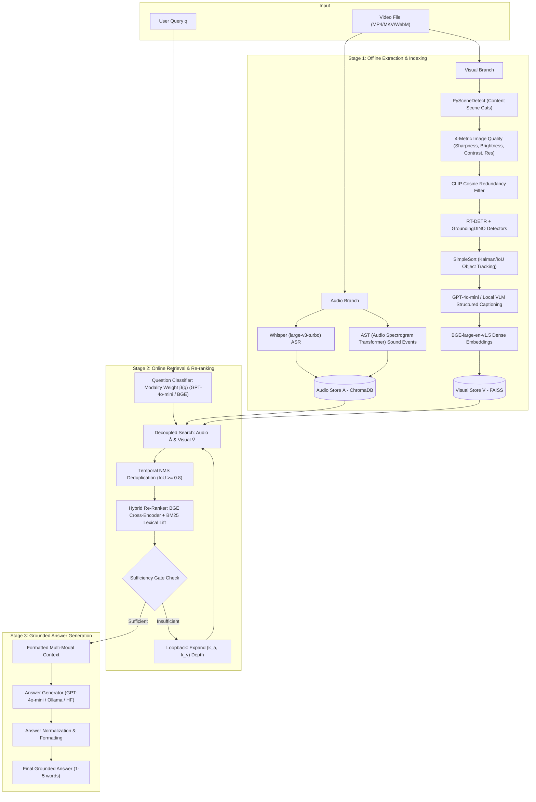

# EchoVision: Cloud Multi-Modal Video QA Framework
### Decoupled Audio-Visual RAG Pipeline for High-Accuracy Video QA

EchoVision is an advanced, multi-modal **Retrieval-Augmented Generation (RAG)** framework designed for **Video Question Answering (Video QA)**. It decouples audio processing (speech transcription and acoustic sound event detection) from visual processing (scene detection, multi-metric image quality assessment, open-vocabulary and real-time object tracking, VLM captioning, and dense embeddings) to deliver accurate, hallucination-resistant, grounded answers.

---

## 🤖 Dedicated 10-Model Cloud Stack

EchoVision integrates an optimized multi-modal ensemble engineered to run reliably within the **15–16 GB VRAM envelope of a single NVIDIA Tesla T4 GPU** (Google Colab free tier / Kaggle GPU T4 x 1):

| Model | Purpose & Use in Pipeline | Stage |
| :--- | :--- | :--- |
| **GPT-4o-mini** | Query modality classification $\beta(q)$, high-fidelity frame captioning, & final grounded answer generation | Stage 1, 2, 3 |
| **BGE-large-en-v1.5** | Dense text embeddings for cross-modal indexing & similarity retrieval | Stage 1, 2 |
| **BM25** | Keyword-based lexical re-ranking across extracted audio and visual facts | Stage 2 |
| **PySceneDetect** | Content-aware adaptive video scene detection and boundary segmentation | Stage 1 |
| **CLIP** | Importance-aware visual keyframe selection and semantic redundancy deduplication | Stage 1 |
| **GroundingDINO** | Open-vocabulary text-guided object detection for nuanced items and fine details | Stage 1 |
| **RT-DETR** | High-throughput real-time object detection for prominent subjects and entities | Stage 1 |
| **SimpleSort** | Multi-frame Kalman/IoU object tracking, 2D quadrant localization, and trajectory analysis | Stage 1 |
| **Whisper large-v3-turbo** | Timestamped speech transcription with high accuracy and low latency | Stage 1 |
| **AST** | Audio Spectrogram Transformer for acoustic event classification & spatial balance | Stage 1 |

---

## 🌐 Run Online: Google Colab & Kaggle (T4 GPU Optimized)

EchoVision can be executed directly in the cloud on **Google Colab** (Free Tier T4 GPU) or **Kaggle Notebooks** (GPU T4 x 1) with zero local installation required!

### 1. 🚀 Google Colab ([`EchoVision_Colab_T4.ipynb`](EchoVision_Colab_T4.ipynb))
[](https://colab.research.google.com)

1. Open [Google Colab](https://colab.research.google.com/) and click **Upload Notebook** $\rightarrow$ select [`EchoVision_Colab_T4.ipynb`](EchoVision_Colab_T4.ipynb).
2. Set Runtime accelerator: **Runtime** $\rightarrow$ **Change runtime type** $\rightarrow$ **T4 GPU** (15-16 GB VRAM).
3. Set your optional `OPENAI_API_KEY` (via Colab Secrets or interactive prompt) to enable **GPT-4o-mini** for frame captioning, query classification, and answer generation.
4. Run the notebook cells sequentially:
   - Automated installation of FFmpeg and multi-modal requirements (`openai`, `rank-bm25`, `timm`, `scenedetect`, `transformers`).
   - Runs Stage 1 Ingestion on `smoketest/videos` with `--sequential` (memory-safe, keeping peak VRAM under 7.5 GB).
   - Runs Stage 2 & 3 Question Answering and displays accuracy metrics.
   - Runs full Ablation studies benchmark suite (`run_ablations.py`).
   - Interactive single-video query demo and one-click zip download of results.

### 2. ⚡ Kaggle Notebooks ([`EchoVision_Kaggle_T4.ipynb`](EchoVision_Kaggle_T4.ipynb))
1. Create a new notebook on [kaggle.com](https://www.kaggle.com/code) and select **File $\rightarrow$ Import Notebook** $\rightarrow$ upload [`EchoVision_Kaggle_T4.ipynb`](EchoVision_Kaggle_T4.ipynb).
2. In the right sidebar settings:
   - **Accelerator**: Select **GPU T4 x 1** (or P100 GPU).
   - **Internet**: Toggle **Internet ON** (Required to download model weights and pip packages).
   - **Secrets (Optional)**: Add `OPENAI_API_KEY` under **Add-ons** $\rightarrow$ **Secrets**.
3. Run all cells:
   - Supports both GPT-4o-mini API generation and in-process Hugging Face generation (`LLM_BACKEND="hf"`).
   - Saves all predictions and evaluation reports directly to `/kaggle/working/output/`.

---

## ⚡ Quick Start: Step-by-Step Local Setup & Execution

Follow these steps to set up and run EchoVision on your machine.

### Step 1: Install System Dependencies

#### 1. Python 3.10+
Ensure Python 3.10 or higher is installed:
```bash
python --version
```

#### 2. FFmpeg (Audio Extraction)
FFmpeg is automatically handled by the bundled `imageio-ffmpeg` package. If you prefer a system-level binary:
- **Windows**: Run in PowerShell or Command Prompt:
  ```cmd
  winget install FFmpeg
  ```
  *(Or download static binaries from [ffmpeg.org](https://ffmpeg.org/) and add `ffmpeg/bin` to system PATH)*
- **Linux (Ubuntu/Debian)**:
  ```bash
  sudo apt update && sudo apt install -y ffmpeg
  ```
- **macOS**:
  ```bash
  brew install ffmpeg
  ```

#### 3. Ollama (Local LLM Server)
Install Ollama from [ollama.com](https://ollama.com/).
After installation, start the server and pull the primary model (`qwen2.5:7b`) or fallback (`qwen2:1.5b`):
```bash
ollama serve
ollama pull qwen2.5:7b
```
*(Optional fallback: `ollama pull qwen2:1.5b`)*

---

### Step 2: Environment Setup & Python Dependencies

Navigate to the project root directory and install the Python requirements:

```bash
# Optional: Create and activate a virtual environment
python -m venv venv

# On Windows:
venv\Scripts\activate
# On Linux/macOS:
source venv/bin/activate

# Install Python requirements
pip install -r requirements.txt
```

---

### Step 3: Prepare Your Dataset Directory Structure

Organize your video files and question JSON files inside a dataset folder (e.g. `dataset/`, `MusicAVQA/`, or `smoke_test/`):

```
EVL3/
├── dataset/
│   ├── videos/
│   │   ├── OFTkwnSh-sQ.mp4
│   │   ├── wE9sQbGdeAk.mp4
│   │   └── er5jUsRr4y0.mp4
│   └── json/
│       └── test_questions.json
```

#### Supported Input JSON Format
The parser supports multiple common schema formats (arrays, single objects, wrapped dicts) and flexible key aliases:
- **Video ID aliases**: `video_name`, `video_id`, `video`, `video_path`, `video_file`, `video_filename`, `filename`, `file_name`, `vid`, `movie`
- **Question aliases**: `question`, `q`, `query`, `question_text`, `text`, `prompt`
- **Ground Truth aliases**: `answer`, `ground_truth_answer`, `ground_truth`, `gt_answer`, `label`, `target`

Sample input format (`dataset/json/test_questions.json`):
```json
[
  {
    "id": 1,
    "category": "spatial",
    "video_name": "v_0q9yZPTBbus",
    "question_id": "v_0q9yZPTBbus_4",
    "question": "what is in front of the person in red clothes",
    "answer": "mirror"
  },
  {
    "id": 2,
    "category": "counting",
    "video_name": "v_0q9yZPTBbus",
    "question_id": "v_0q9yZPTBbus_7",
    "question": "how many people are there in the video",
    "answer": "2"
  }
]
```

---

### Step 4: Run the EchoVision Pipeline (Two-Step Workflow)

#### 1. Run `ingestion.py` for Stage 1 (Offline Feature Extraction & Isolated Vector Indexing):
```bash
python ingestion.py --dataset_dir dataset
```
*What happens:*
- Recursively scans `dataset/videos/`.
- Extracts audio speech (`Whisper-large-v3`) & acoustic sound events (`LAION-CLAP`) with silence filtering $\rightarrow$ saves to an isolated **ChromaDB** collection.
- Detects scene cuts (`PySceneDetect`), evaluates 4-metric image quality (sharpness, brightness, contrast, resolution), selects representative clear frames, removes redundancy (`CLIP` similarity), generates structured scene descriptions (`Qwen2.5-VL`), extracts temporal action transitions $\rightarrow$ saves to an isolated **FAISS** index and saves keyframes to `data/keyframes/`.
- All indices are uniquely stored per video in `data/vector_stores/<video_stem>_<hash>/` preventing cross-contamination.

#### 2. Run `main.py` for Stage 2 (Retrieval & Re-ranking) and Stage 3 (LLM Answer Generation):
```bash
python main.py --dataset_dir dataset --output_dir output
```
*What happens:*
- Discovers and loads pre-indexed Stage 1 vector stores from disk.
- Parses `dataset/json/` questions and groups them by matched video.
- Dynamically estimates modality dependency ($\beta(q) \in [0, 1]$) and retrieves candidates from ChromaDB and FAISS.
- Applies audio-aware cross-encoder re-ranking (`BAAI/bge-reranker-large`), Temporal NMS deduplication, and sufficiency verification.
- Generates concise, grounded answers (1 to 5 words) using the local Ollama LLM (`qwen2.5:7b` / `qwen2:1.5b`).
- Saves answers and video durations to `output/`.

#### Automatic Ingestion in One Command
You can run both Stage 1 and Stage 2/3 in a single command using `--auto-ingest`:
```bash
python main.py --dataset_dir dataset --output_dir output --auto-ingest
```

---

### Step 5: Check Your Generated Output

The resulting output file (e.g. `output/test_questions.json`) contains predictions along with the ground truth and exact video duration:

```json
[
  {
    "video_id": "v_0q9yZPTBbus",
    "question": "how many people are there in the video",
    "ground_truth_answer": "2",
    "predicted_answer": "2",
    "video_duration_sec": 119.792
  },
  {
    "video_id": "v_0q9yZPTBbus",
    "question": "what is in front of the person in red clothes",
    "ground_truth_answer": "mirror",
    "predicted_answer": "mirror",
    "video_duration_sec": 119.792
  }
]
```

---

## 🧪 Ablation Studies (Switch One Component Off at a Time)

EchoVision includes a modular ablation framework allowing researchers to evaluate each architectural component in isolation by switching off individual features:

| # | Ablation Experiment | Hypothesis & Scientific Motivation | CLI Flag / Preset |
| :-: | :--- | :--- | :--- |
| **1** | **Joined vs. Separated Stores** | Merges audio and visual facts into a **single unified vector store** using a shared dense text embedder. Directly tests the central claim that decoupled modality indexing prevents visual dominance and reduces cross-modal hallucination. | `--ablation joint_store`<br>`--joint-store` |
| **2** | **Re-ranking Lift (On vs. Off)** | Removes the audio-aware lift ($\beta(q) \cdot \text{AudioBonus}$) from cross-encoder scoring. Measures how much of the "silence failure" (visual bias drowning out sound) is solved by modality-aware re-ranking. Also supports bypassing cross-encoder re-ranking entirely. | `--ablation no_audio_lift`<br>`--no-audio-lift`<br>`--no-rerank` |
| **3** | **Sufficiency Stop vs. Fixed Cutoff** | Replaces the adaptive modality gate and loopback retrieval depth expansion with a **static, fixed amount of evidence**. Empirically shows the value of the principle: *"never answer a sound question without verified sound evidence."* | `--ablation fixed_cutoff`<br>`--fixed-cutoff` |
| **4** | **Audio Removed Entirely** | Disables audio retrieval entirely and allocates all retrieval budget to visual evidence. Serves as the **honesty check / visual-only baseline**, measuring how much of the overall QA accuracy gain comes from audio information. | `--ablation no_audio`<br>`--no-audio`<br>`--visual-only` |

---

### 🚀 Running Ablation Experiments

#### 1. Run Automated Full Ablation Benchmark Suite (`run_ablations.py`)
Run all 4 ablations + the baseline EchoVision pipeline in a single command over your dataset. It automatically executes all runs, evaluates accuracy metrics against ground truth, and outputs formatted Markdown and JSON comparison reports:

```bash
# Run all ablations on smoke_test dataset
python run_ablations.py --dataset_dir smoketest

# Run on custom dataset or MusicAVQA
python run_ablations.py --dataset_dir dataset/musicAVQA --output_dir output/ablations_music

# Run specific selected ablations
python run_ablations.py --dataset_dir smoketest --ablations full joint_store no_audio_lift fixed_cutoff no_audio
```

*Output:* Generates comparative Markdown summary table (`output/ablations/ablation_summary.md`), detailed JSON report (`output/ablations/ablation_summary.json`), and individual run prediction folders (`output/ablations/<ablation_name>/`).

#### 2. Run Individual Ablations with `main.py`

##### Ablation 1: Joined vs. Separated Stores
```bash
python main.py --dataset_dir smoketest --ablation joint_store
# or using shortcut flag:
python main.py --dataset_dir smoketest --joint-store
```

##### Ablation 2: Re-ranking Without Audio-Aware Lift / Re-ranking Off
```bash
# Remove audio-aware lift term (relevance + temporal agreement only)
python main.py --dataset_dir smoketest --ablation no_audio_lift
# or using shortcut flag:
python main.py --dataset_dir smoketest --no-audio-lift

# Disable cross-encoder re-ranking entirely (raw retriever scores)
python main.py --dataset_dir smoketest --ablation no_rerank
# or using shortcut flag:
python main.py --dataset_dir smoketest --no-rerank
```

##### Ablation 3: Sufficiency Stop vs. Fixed Cutoff
```bash
# Replace adaptive modality gate with fixed evidence cutoff (no loopbacks)
python main.py --dataset_dir smoketest --ablation fixed_cutoff
# or using shortcut flag:
python main.py --dataset_dir smoketest --fixed-cutoff
```

##### Ablation 4: Audio Removed Entirely (Visual-Only Baseline)
```bash
# Disable audio completely (honesty check)
python main.py --dataset_dir smoketest --ablation no_audio
# or using shortcut flags:
python main.py --dataset_dir smoketest --no-audio
python main.py --dataset_dir smoketest --visual-only
```

##### Single Video QA Mode with Ablation
```bash
python main.py --video smoketest/videos/v_0q9yZPTBbus.mp4 --question "what is in front of the person in red clothes" --ablation joint_store
```

---

## 🖥️ Detailed Execution Modes & Commands

### 1. Batch Dataset Processing (Default)
Runs processing over default `dataset/videos/` and `dataset/json/` folders and outputs to `output/`:
```bash
python main.py
```

### 2. Auto-Ingestion Mode
Processes questions and automatically executes Stage 1 ingestion for any video missing an existing vector store:
```bash
python main.py --auto-ingest
```

### 3. Running Pre-Packaged Datasets (e.g. `smoketest` or `MusicAVQA`)
```bash
# Run smoke test dataset
python main.py --dataset_dir smoketest --output_dir output_smoke --auto-ingest

# Run MusicAVQA dataset
python main.py --dataset_dir dataset/musicAVQA --output_dir output_music --auto-ingest
```

### 4. Custom Input & Output Directories
Specify custom directories for videos, question JSONs, or output:
```bash
python main.py --videos_dir path/to/my_videos --json_dir path/to/my_jsons --output_dir path/to/my_results
```

### 5. Single Video & Interactive Prompt QA Mode
Test a single video file directly with a custom question prompt:
```bash
python main.py --video smoketest/videos/v_0q9yZPTBbus.mp4 --question "what is in front of the person in red clothes"
```

### 6. Standalone Stage 1 Ingestion Only
Pre-extract features and build vector stores for videos without running QA inference:
```bash
python ingestion.py --dataset_dir dataset
# or specify custom video directory:
python ingestion.py --videos_dir dataset/videos
```

### 7. Force Re-Indexing
Force re-extraction and re-indexing of Stage 1 even if cached index files exist on disk:
```bash
python main.py --dataset_dir dataset --force-reindex
```

### 8. Interactive Jupyter Notebook
An end-to-end interactive Jupyter notebook is available:
- **`EchoVision_Pipeline.ipynb`**: Walk through configuration, offline extraction, decoupled vector search, re-ranking, and answer generation step-by-step with visual cell outputs.

---

## 🛠️ CLI Options Reference

| Argument | Type | Default | Description |
| :--- | :--- | :--- | :--- |
| `--dataset_dir` | `str` | `dataset` | Root path containing `videos/` and `json/` subdirectories. |
| `--videos_dir` | `str` | `None` | Custom path to video directory (overrides `dataset_dir/videos`). |
| `--json_dir` | `str` | `None` | Custom path to question JSON directory (overrides `dataset_dir/json`). |
| `--output_dir` | `str` | `output` | Directory where output JSON files and evaluation reports are saved. |
| `--video` | `str` | `None` | Path to a single video file (triggers single-video QA mode). |
| `--question` | `str` | `None` | Prompt string for single-video QA mode. |
| `--force-reindex`| `flag`| `False` | Forces re-extraction and indexing of Stage 1 even if cached index exists. |
| `--auto-ingest` | `flag`| `False` | Automatically triggers Stage 1 ingestion for videos missing vector stores. |
| **`--ablation`** | `str` | `none` | Named ablation preset (`none`, `full`, `joint_store`, `no_rerank`, `no_audio_lift`, `fixed_cutoff`, `no_audio`, `visual_only`). |
| **`--store_mode`** | `str` | `separated` | Vector store mode: `separated` (decoupled) vs `joint` (merged unified store). |
| **`--rerank_mode`**| `str` | `full` | Re-ranking mode: `full`, `no_audio_lift`, or `off`. |
| **`--sufficiency_mode`** | `str` | `adaptive` | Sufficiency gate mode: `adaptive` vs `fixed` (fixed cutoff). |
| **`--modality_mode`** | `str` | `audio_visual` | Modality mode: `audio_visual` vs `visual_only`. |
| **`--joint-store`** | `flag` | `False` | Shortcut for `--store_mode joint` (Joined vs separated stores ablation). |
| **`--no-audio-lift`** | `flag` | `False` | Shortcut for `--rerank_mode no_audio_lift` (Removes audio lift bonus). |
| **`--no-rerank`** | `flag` | `False` | Shortcut for `--rerank_mode off` (Disables cross-encoder re-ranking). |
| **`--fixed-cutoff`** | `flag` | `False` | Shortcut for `--sufficiency_mode fixed` (Fixed cutoff evidence stop). |
| **`--no-audio` / `--visual-only`** | `flag` | `False` | Shortcut for `--modality_mode visual_only` (Audio removed entirely). |

---

## 🏗️ System Architecture Flowchart



---

## 📁 Repository Directory Overview

```
.
├── main.py                     # Primary CLI entry point (Batch dataset QA & single video QA)
├── ingestion.py                # Dataset scanner & Stage 1 ingestion manager
├── config.py                   # Central configuration, hardware detection, & hyperparameters
├── EchoVision_Colab_T4.ipynb   # Complete Google Colab T4 GPU Notebook
├── EchoVision_Kaggle_T4.ipynb  # Complete Kaggle T4 GPU Notebook
├── requirements.txt            # Python package dependencies
├── README.md                   # Project documentation & execution guide
│
├── stage1_offline/             # Stage 1: Feature extraction & vector storage
│   ├── audio_extractor.py      # Speech transcription (Whisper turbo) & sound tagging (AST)
│   ├── visual_extractor.py     # Scene keyframes, quality filter, GPT-4o-mini/VLM captions, CLIP embeddings
│   ├── object_detector.py      # Unified RT-DETR + GroundingDINO detector with NMS
│   ├── simple_sort.py          # Zero-dependency Kalman/IoU SimpleSort object tracker
│   └── vector_indexer.py       # Isolated ChromaDB and FAISS index manager
│
├── stage2_online/              # Stage 2: Retrieval, reranking & sufficiency gate
│   ├── question_classifier.py  # Modality estimator β(q) via GPT-4o-mini & BGE anchors
│   ├── decoupled_retriever.py  # Independent vector search over audio/visual indices
│   ├── deduplicator.py         # Temporal Non-Maximum Suppression (NMS)
│   ├── reranker.py             # Audio-boosted cross-encoder + BM25Okapi keyword re-ranking
│   └── sufficiency_gate.py     # Evidence sufficiency evaluator & loopback controller
│
├── stage3_generator/           # Stage 3: Context fusion & LLM answer generation
│   └── generator.py            # GPT-4o-mini / Ollama / HuggingFace multi-backend generator
│
├── dataset/                    # Default dataset directory
│   ├── videos/                 # Video files (.mp4, .mkv, .webm, etc.)
│   └── json/                   # Question JSON annotations
│
├── smoketest/                  # Lightweight smoke test dataset for rapid validation
└── data/                       # Generated runtime data (auto-created)
    ├── keyframes/              # Extracted keyframe images & metadata.json per video
    └── vector_stores/          # Hash-isolated ChromaDB & FAISS indices per video
```

---

## 🔧 Hardware & Configuration Tuning (`config.py`)

All settings, thresholds, and model parameters can be tuned directly in `config.py`:

- **Hardware Setup & Dual Mode**:
  - Automatically detects **CUDA GPU**, **Intel XPU**, **DirectML**, or **CPU Fallback Mode**.
  - On Tesla T4 GPU, runs in `float16` precision with sequential ingestion (`--sequential`) keeping peak VRAM < 7.5 GB.
- **Model Identifiers**:
  - `GPT_MODEL`: `"gpt-4o-mini"` (Used when `OPENAI_API_KEY` is provided)
  - `WHISPER_MODEL`: `"large-v3-turbo"` (Fast, high-accuracy timestamped speech transcription)
  - `AST_MODEL`: `"MIT/ast-finetuned-audioset-10-10-0.4593"` (Audio Spectrogram Transformer)
  - `TEXT_EMBEDDING_MODEL`: `"BAAI/bge-large-en-v1.5"` (Dense text embeddings)
  - `RTDETR_MODEL`: `"PekingU/rtdetr_r50vd"` (Real-time object detection)
  - `GROUNDING_DINO_MODEL`: `"IDEA-Research/grounding-dino-tiny"` (Open-vocabulary detection)
  - `CLIP_MODEL`: `"openai/clip-vit-base-patch32"` (Keyframe selection and filtering)
  - `ENABLE_BM25`: `True`, `BM25_WEIGHT`: `0.4` (Lexical keyword re-ranking)
  - `OLLAMA_MODEL`: `"qwen2.5:1.5b"` (Offline local LLM fallback)
- **Retrieval & Reranking Hyperparameters**:
  - `KA_DEFAULT`: `5` (Default audio top-$k$ depth)
  - `KV_DEFAULT`: `10` (Default visual top-$k$ depth)
  - `SIMILARITY_THRESHOLD`: `0.90` (CLIP cosine similarity threshold for keyframe redundancy)
  - `NMS_OVERLAP_THRESHOLD`: `0.8` (Temporal IoU threshold for pruning redundant evidence)
  - `MODALITY_THRESHOLD`: `0.6` (Threshold above which a question is classified as audio-heavy)
  - `AUDIO_BONUS`: `1.0` (Weight multiplier added to candidate score when $\beta(q)$ is high)
  - `TEMPORAL_AGREEMENT_BONUS`: `0.5` (Bonus awarded to evidence sharing temporal windows)
- **Visual Quality & Keyframe Settings**:
  - `BLUR_THRESHOLD`: `100.0` (Laplacian variance threshold for sharpness)
  - `DARK_THRESHOLD`: `15.0` (Mean pixel brightness threshold)
  - `BRIGHTNESS_MAX_THRESHOLD`: `240.0` (Overexposure threshold)
  - `LOW_CONTRAST_THRESHOLD`: `20.0` (Pixel standard deviation threshold)
  - `CANDIDATE_SAMPLES_PER_SCENE`: `5` (Candidate frames evaluated per detected scene)
  - `MAX_KEYFRAMES`: `75` (GPU) / `50` (CPU)
  - `MAX_SCENE_WINDOW_SEC`: `4.0` (Sub-segmentation window size in seconds)

---

## ❓ Troubleshooting & FAQs

#### Q1: "Ollama connection error" or "Failed to connect to http://localhost:11434"
- Ensure the Ollama service is running in the background:
  ```bash
  ollama serve
  ```
- Pull the required model:
  ```bash
  ollama pull qwen2.5:7b
  ```

#### Q2: "Working FFmpeg executable not found"
- The pipeline uses `imageio-ffmpeg` as an automatic fallback. If a custom system FFmpeg is preferred, ensure `ffmpeg` is accessible in your system `PATH` (run `ffmpeg -version` to verify).

#### Q3: "Question could not be matched to any video"
- EchoVision features an intelligent prefix-stripping matching engine (handles prefixes like `v_`, `video_`, file extensions, and casing).
- Ensure the `video_id` or `video_name` in your question JSON corresponds to the video file name in `dataset/videos/`.

#### Q4: "CUDA Out of Memory during Stage 1 Extraction"
- Stage 1 extractors automatically clear GPU caches between batches.
- You can reduce `CLIP_BATCH_SIZE` or `AUDIO_BATCH_SIZE` in `config.py` if running on lower VRAM GPUs.

---

## 📄 License

This project is licensed under the MIT License.

